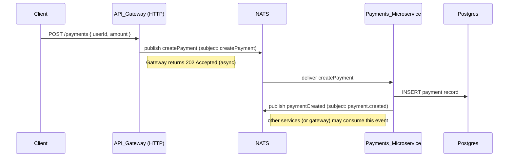

# mkstore

[](https://nestjs.com/)
[](https://nodejs.org/)
[](https://docs.docker.com/compose/)

A modular microservices example repository using NestJS, NATS (pub/sub & request/reply), and TypeORM. The project demonstrates a practical layout for an API Gateway and two focused microservices (users and payments), containerized with Docker Compose for local development.

## Table of Contents

- [Architecture Overview](#architecture-overview)
- [Features](#features)
- [Prerequisites](#prerequisites)
- [Quick Start](#quick-start)
- [Service Configuration & Environment Variables](#service-configuration--environment-variables)
- [API Endpoints & DTOs](#api-endpoints--dtos)
- [Development Workflow](#development-workflow)
- [Testing](#testing)
- [Monitoring & Health Checks](#monitoring--health-checks)
- [Security Considerations](#security-considerations)
- [Deployment Suggestions](#deployment-suggestions)
- [Troubleshooting](#troubleshooting)
- [Contributing](#contributing)
- [License](#license)

---

## Architecture Overview

High-level system diagram (gateway, services, NATS, DB):

```mermaid
graph TB
    Client[Client Applications] -->|HTTP → 3000| Gateway[HTTP API Gateway<br/>Port: 3000]
    Gateway -->|NATS publish / request| NATS[(NATS Broker<br/>nats:4222)]
    NATS --> Payments[Payments Microservice<br/>(NATS consumer)]
    NATS --> Users[Users Microservice<br/>(NATS consumer)]
    Payments -->|TypeORM| Postgres[(PostgreSQL<br/>mkstore:5432)]
    Users -->|TypeORM| Postgres
    Payments -->|emit event| NATS
    Users -->|reply / emit| NATS
    style NATS fill:#f3f4f6,stroke:#333,stroke-width:1px
```

### Service Communication Flow (tailored)

```
┌─────────────────┐    ┌────────────────────────────────────┐    ┌────────────────────────────────────┐
│   API Gateway    │    │   Users Microservice (NATS only)   │    │ Payments Microservice (NATS only)  │
│   (HTTP, 3000)  │───▶│   (subscribes to NATS subjects)    │◄───│   (subscribes to NATS subjects)    │
└─────────────────┘    └────────────────────────────────────┘    └────────────────────────────────────┘
         │                         ▲                        ▲
         │                         │                        │
         ▼                         │                        │
    ┌────────┐                     │                        │
    │  NATS  │─────────────────────┘                        │
    │ 4222   │  (pub/sub & request/reply broker)             │
    └────────┘                                              │
         │                                                 │
         ▼                                                 │
  ┌────────────┐                                            │
  │ PostgreSQL │◄───────────────────────────────────────────┘
  │   5432     │
  └────────────┘
```

Sequence for creating a payment:



Notes:
- Gateway mediates client traffic and can perform lightweight validation, auth checks, or proxy requests to microservices.
- Services communicate via NATS for event-driven flows and request/reply where low-latency RPC-like behavior is desired.
- Each microservice owns its database schema and TypeORM entities.

## Features

- API Gateway for client-facing HTTP APIs
- Users microservice: CRUD for users, DTO validation, authentication hooks
- Payments microservice: create & persist payments, emit events
- Inter-service messaging via NATS (pub/sub + request/reply)
- Persistence with TypeORM (Postgres or other supported RDBMS)
- Docker Compose setup for local development

## Prerequisites

- Docker & Docker Compose (for local stacks)
- Node.js (>=16 recommended) for local development
- npm or yarn
- (Optional) Postgres for running services without Docker

OS: Windows/macOS/Linux supported.

## Quick Start

Start everything with Docker Compose (recommended):

```powershell
# From repository root
docker-compose up --build -d

# Watch logs (example)
docker-compose logs -f http-api-gateway
```

Start a single service locally while using dockerized infra:

```powershell
# start infra only (nats, postgres)
docker-compose up -d nats postgres

# then from a service folder
cd http-api-gateway
npm install
npm run start:dev
```

Note: service scripts follow NestJS conventions (start, start:dev, build, test).

## Service Configuration & Environment Variables

Each service reads environment variables to configure connections and behavior. Below are suggested variable names and an example .env block per service.

General variables used across services:

- NATS_URL (e.g. nats://nats:4222)
- NODE_ENV (development | production)

http-api-gateway (example .env)

```env
PORT=3000
NATS_URL=nats://nats:4222
JWT_SECRET=changeme
NODE_ENV=development
```

payments-microservice (example .env)

```env
DB_HOST=postgres
DB_PORT=5432
DB_USER=postgres
DB_PASSWORD=postgres
DB_DATABASE=payments_db
TYPEORM_SYNCHRONIZE=true
NATS_URL=nats://nats:4222
```

users-microservice (example .env)

```env
DB_HOST=postgres
DB_PORT=5432
DB_USER=postgres
DB_PASSWORD=postgres
DB_DATABASE=users_db
TYPEORM_SYNCHRONIZE=true
NATS_URL=nats://nats:4222
```

Tip: Add a repo-level .env.example with all variables and copy it into per-service folders as needed.

## API Endpoints & DTOs

Gateway exposes client-facing endpoints. Inside the codebase the controllers and DTOs live at:

- `http-api-gateway/src/payments/` — controller and `dtos/CreatePayment.dto.ts`
- `http-api-gateway/src/users/` — controller and `dtos/CreateUser.dto.ts`
- `payments-microservice/src/payements/` — controller/service/dto (note: folder name "payements" exists in repo)
- `users-microservice/src/users/` — controllers/services/dtos

Canonical example endpoints (gateway)

- POST /payments — create a payment (body uses CreatePaymentDto)
- GET  /users/:id — fetch user (used by gateway to validate requests)

CreatePaymentDto (shape):

- userId: string
- amount: number
- currency?: string (default: "USD")
- metadata?: object

CreateUserDto (shape):

- email: string
- password: string
- name?: string

Validation is typically implemented with class-validator + class-transformer in DTOs.

## Development Workflow

Run and develop a single service with hot reload:

```powershell
cd http-api-gateway
npm install
npm run start:dev
```

Run all services (docker):

```powershell
docker-compose up --build
```

Build production artifacts:

```powershell
cd http-api-gateway
npm run build
```

Common npm scripts (per service):
- `start:dev` — run with hot-reload (ts-node-dev or nest start --watch)
- `start` — run compiled JS
- `build` — compile TypeScript
- `test`, `test:e2e` — run unit/e2e tests

Development contract (tiny):

- Inputs: HTTP requests at gateway, NATS messages
- Outputs: DB records, NATS events, HTTP responses
- Error modes: DB unavailable, NATS unavailable, validation errors

Edge cases to consider:
- Missing/invalid DTO fields
- Downstream service (DB or NATS) unavailability
- Duplicate events or retries

## Testing

Each subproject contains `test/` with e2e tests using Nest's testing utilities.

Run tests for a service:

```powershell
cd users-microservice
npm run test
npm run test:e2e
```

Note: e2e tests often depend on infra (NATS, Postgres) — start them via Docker Compose first.

## Monitoring & Health Checks

- Add health endpoints in each service (`/health`) and check container health in Docker Compose.
- Emit events for key domain changes (`payment.created`, `user.updated`) so other services can subscribe.

Suggested checks:

- `curl http://localhost:3000/health` (gateway)
- `curl http://localhost:<service-port>/health` (microservices)

## Security Considerations

- Use JWT signing keys and rotate periodically (store secrets in a secret manager for production).
- Hash passwords with a strong algorithm (bcrypt/argon2). The repo already references `argon2` in some services.
- Use TLS between services in production or run in a secure network.
- Rate-limit external endpoints at the gateway level.

## Deployment Suggestions

- Container images per service; orchestrate with Docker Compose for dev and Kubernetes for production.
- Use a message broker (NATS) with HA for production workloads.
- Run DB migrations instead of `synchronize: true` in production environments.

Example (production) Docker Compose pattern:

```powershell
docker-compose -f docker-compose.prod.yml up --build -d
```

Scale services in Kubernetes or Docker Swarm as needed.

## Troubleshooting

Service won't start?

```powershell
docker-compose logs <service-name> --tail 200
```

DB connection issues:

```powershell
docker-compose exec postgres pg_isready -U postgres
```

NATS connectivity issues:

```powershell
docker-compose logs nats
```

If DTO validation fails, inspect DTO classes under `*/dtos/` and validate request payloads.

## Contributing

1. Fork the repository
2. Create a feature branch
3. Make changes and add tests
4. Run tests locally
5. Open a Pull Request

Development guidelines:

- Keep modules small and focused
- Add tests for new business rules
- Update docs when changing APIs or env vars

## License

This repository does not include a LICENSE file by default. Add an open-source license (MIT/Apache-2.0) if you plan to publish the project.

## Acknowledgements

- NestJS — framework used for services
- NATS — messaging backbone
- TypeORM — ORM for persistence

---

Requirements coverage:

- Provide a comprehensive `README.md` that documents the project, architecture, run/development steps, env variables, DTOs, testing, and includes mermaid diagrams: Completed
- Keep diagrams and examples aligned to repo structure (`http-api-gateway`, `payments-microservice`, `users-microservice`): Completed

If you'd like I can now:

- add a repo-level `.env.example` with all environment variables used by services
- generate individual `README.md` files under each service with service-specific env vars and endpoints
- create a small script to run local dev infra (start DB + NATS via Docker and run a service locally)

